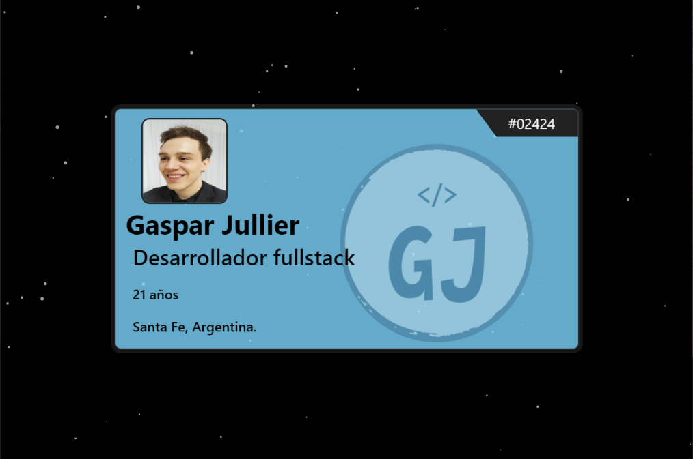

# Mi Web Frontend

#### Sitio web personal desarrollado en Angular con conexión API (Java backend) para obtener informacion mostrada en la pagina desde una base de datos (MySql)

!!! Servidor backend caido descontinuado.
Ver sitio estatico https://github.com/GaspyGJ/Mi_Web_Frontend_Static.
Abrir web [CLICK AQUI](https://gaspy-dev.web.app/)

## Development server

Run `ng serve` for a dev server. Navigate to `http://localhost:4200/`.
